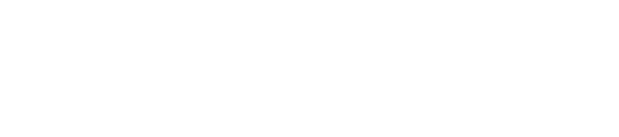
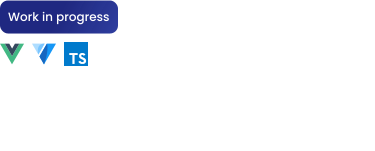
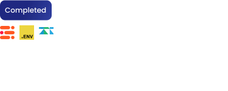

<a href="#">
  

    
    
  

  

    
    
    
    
  

</a>

  

    
    
  

  

  

    
    
    

        
        
    

    
    
    
  

  

    <a href="#">
      

        
      

    </a>
    

      
      
      
    

  

</a>
